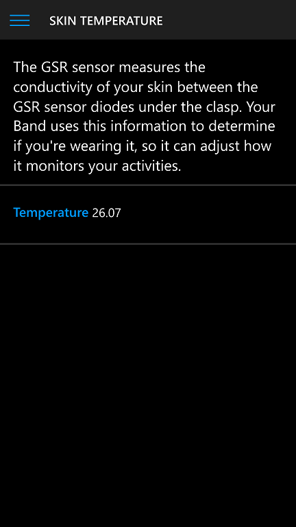
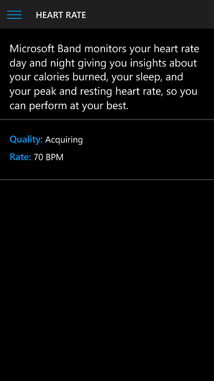

# AllInOneSensor 

A UWP App (sample) to display realtime values of MS Band Sensors. 

## Screenshots

## Problems / Bugs

UV and HR sensor data parsing "mulfunction".

## Author / References

Francesco Bonacci / AllInOneSensor
